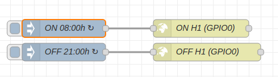

Dissenya l'electrònica, el firmware i l'app de mòbil per controlar una sala de consultes mèdiques amb els següents dispositius: 

* Encesa i apagada via app i automàtica de un punt de llum, **H1** a GPIO0.
* Encesa i apagada mitjançant pulsador físic **S1** a GPIO12, app i automàtica de un punt de llum, **H2** a GPIO2.
* Sensor de finestra oberta, **F** a GPIO14.
* Sensor de nivell de llum, **LL** a ADC0.
* Sensor de temperatura DHT11 o DHT22, **T** a GPIO10. Sensor de temperatura DS18B20, **T** a GPIO10.
* A l'app es graficarà els valors mesurats pels diferents sensors.

Ara amb l'ajuda de [node-red](http://localhost:1880) configura les seguents caracteristiques:

* El punt de llum H1 s'encendrà automàticament a les 8:00 hores de cada matí de dilluns a divendres.
* El punts de llum H1 i H2 s'apagarà automàticament a les 21:00 hores.
* L'obertura d'una de les finestres enviarà una notificació a l'app i un correu electrònic.
* API per encendre el llum H1 (GPIO0) http://167.86.87.117:8080/XXXXXXXXXXXXXXXXXXXXXXXXXXXXXXX/update/D0?value=0
* API per apagar el llum H1 (GPIO0) http://167.86.87.117:8080/XXXXXXXXXXXXXXXXXXXXXXXXXXXXXXX/update/D0?value=1

